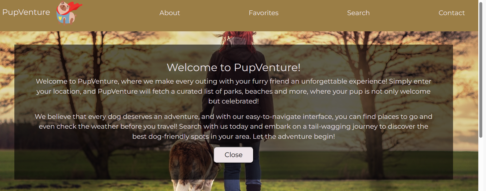

# dog-friendly-locations

## Description

The aim of this app is to provide a dog owner with a list of friendly locations i.e. parks, beaches etc, where they can take their pet. Simply, the user needs to input the date, their location in order to find these places. Additionally, they will also be able to see the weather forecast before they make their journey. 

## Usage

The user can enter their location in the search box and click 'search'.

The information with relevant results is then displayed, together with the current weather conditions.

Please see below the screenshot of the website:

To access the website and the GitHub repo please follow the links below: 

https://ibalan92.github.io/dog-friendly-locations/

https://github.com/ibalan92/dog-friendly-locations

## Credits

Favicon Image by Birgit from Pixabay.

Logo by Md Abdul Rashid from Pixabay.

About Section Image by Sven Lackmann from Pixabay.

Favourites Image by Katrina_S from Pixabay.

Footer Design inspired by MDBootstrap.com.

## License

This project is MIT licensed.

MIT License.

